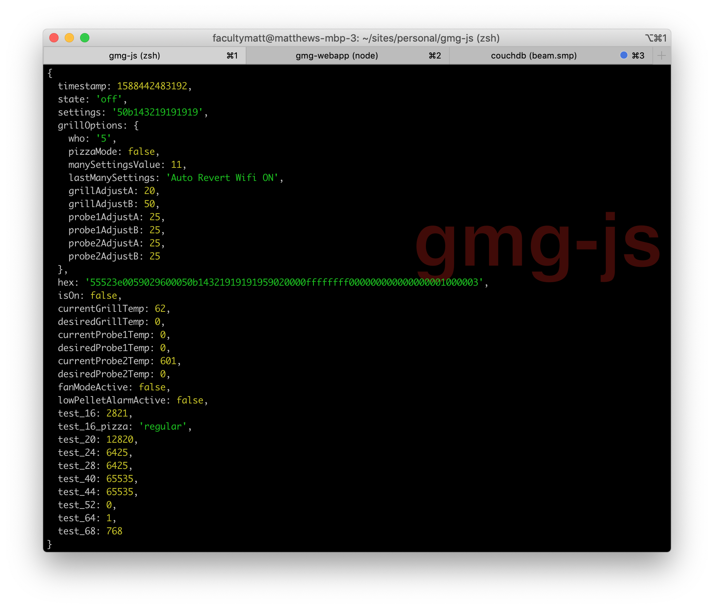

This is a javascript application designed to connect to your GMG and record it's status to a database so informative charts can be generated and cooks can be saved for learning purposes (ex: how long did my last 12lb brisket cook take and when was the stall complete?)

> This project is still work in progress (WIP) and while it's stable enough that I use it every time I run my GMG, there are still some limitations and bugs that need to be resolved.

> Remember you are controlling an appliance that makes heat and fire 🔥🔥🔥 - be safe!

> NOTE on setting pizza mode - this commands ajusts your settings, its reccomended to make sure you settings are correct after sending this command by using the GMG app.

# Dev getting started

## Dependencies 

- Couchdb, I reccomend installing using homebrew: https://formulae.brew.sh/formula/couchdb. Couchdb was chosen because it's enterprise grade, real-time (via changes feed), can be run on a rasberry pi, and the browser/ webapp can connect directly to it.
- Node 12 (and npm) - can be installed from https://nodejs.org/en/download/ or using `nvm`

## React UI

- Currently hosted as a seperate project (maybe combine with lerna in future). Checkout and get running by visiting: https://github.com/facultymatt/gmg-webapp

## Configure

- Find your grill IP. This can be done by looking at your network / router connected devices interface (google wifi has a great interface for this). The grill is called something like "unnamed devide".
- Open `config.js` and enter your Grill IP. 
- Enter a database name. Currently the way to save different cooks is the manually change this value. 

## Run and confirm it's working

- start couchdb in a seperate command window - `couchdb`
- install project dependencies `npm install`
- run `npm start`
- confim you see a grill status printed to console. IF YOU HAVE THE CORRECT IP you will see status. If no status displays, check your IP and try again.
- open the webapp project directory and get that running. 

## Database UI

- You can visit http://localhost:5984/_utils/#/_all_dbs for a slick CouchDB UI.